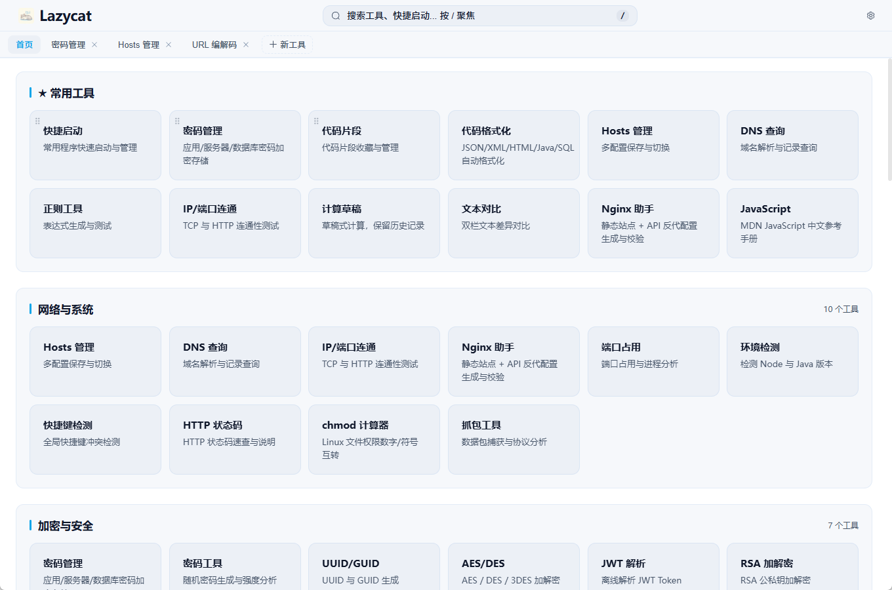
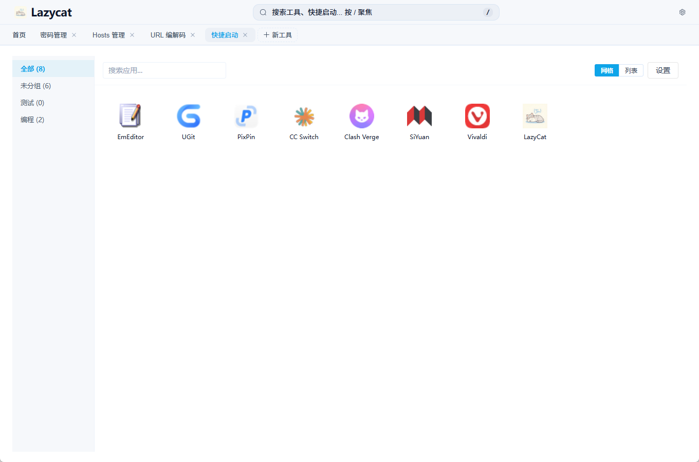
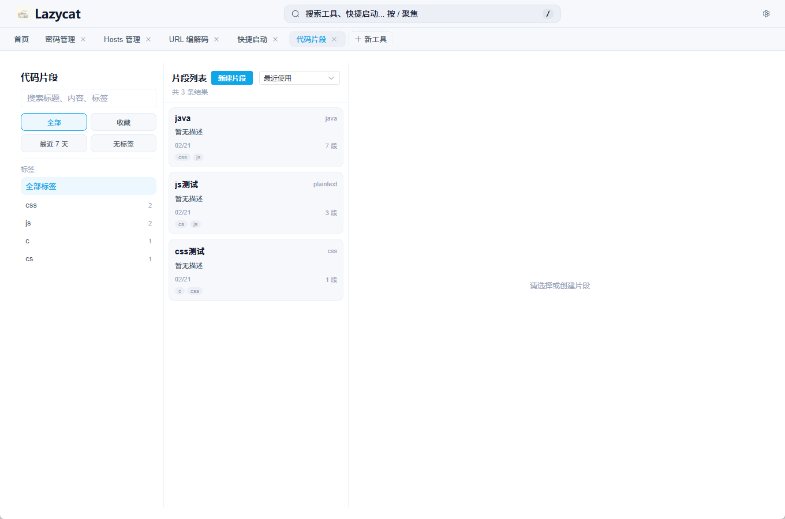
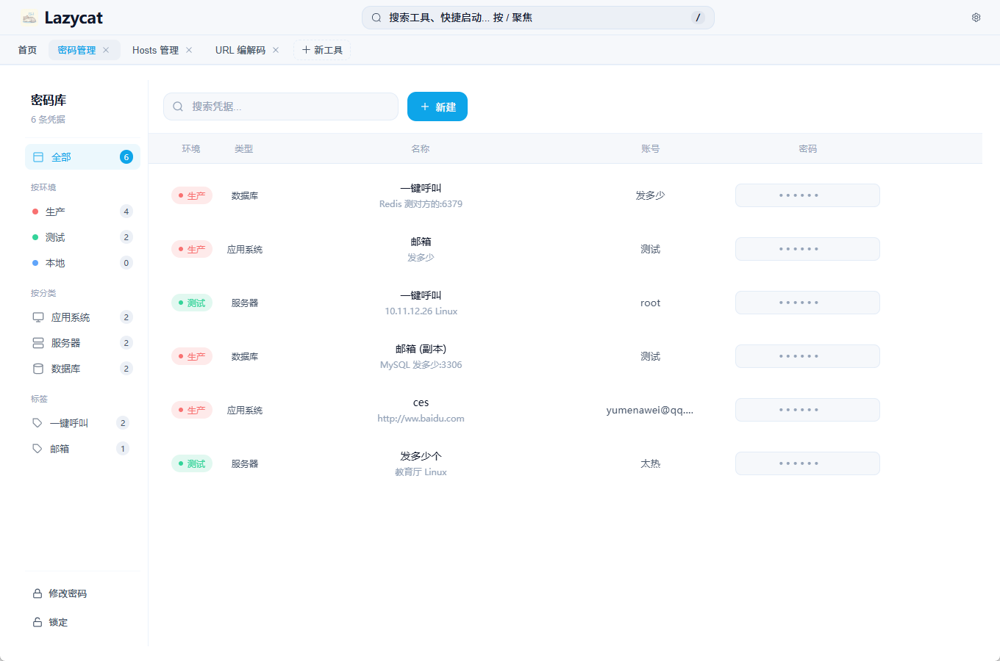
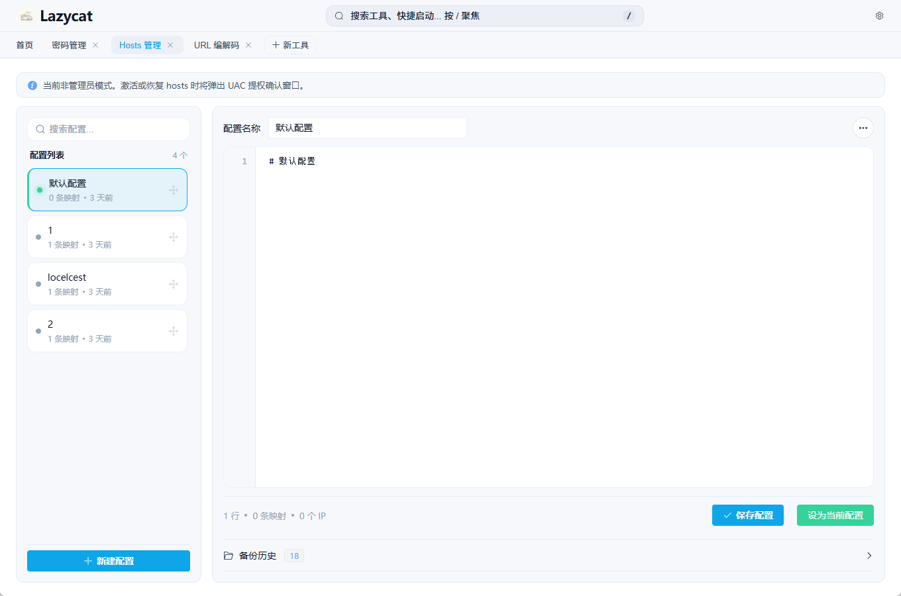

# Lazycat / 懒猫


> 面向开发者的离线效率工作台 -- 53 个工具 + 3 套离线手册，配套 Spotlight 全局搜索、桌面挂件、项目管理、富文本笔记，开箱即用、数据不出机。

## 为什么是 Lazycat

- **纯离线执行**：所有工具本地运行，不依赖外部 API、无 CDN 运行时依赖
- **数据本地优先**：用户数据写入本地 SQLite，不上传云端
- **一站式集成**：覆盖编码、加密、转换、网络、文件、时间、离线手册等常见研发流程
- **轻量桌面架构**：Tauri 2 + Rust 后端，启动快、占用低
- **可定制工作台**：支持收藏、搜索、快捷启动、菜单显隐、快捷键等个性化配置
- **效率增强**：Spotlight 全局搜索、桌面挂件、项目管理多视图、富文本笔记，把零散工具串成工作流

项目完全开源，核心能力与数据流透明可审计，欢迎按自己的工作流扩展工具、面板或离线手册。

## 下载与安装

前往 [GitHub Releases](https://github.com/woniuxia/LazyCat/releases/latest) 下载最新版本。

| 产物 | 文件名格式 | 说明 |
|------|-----------|------|
| 轻量安装包 | `Lazycat_x.y.z_x64_setup-lite.exe` | 需联网安装 WebView2 |
| 离线安装包 | `Lazycat_x.y.z_x64_setup-full.exe` | 内含 WebView2，离线可用 |
| 轻量便携版 | `Lazycat_x.y.z_x64_portable-lite.zip` | 解压即用，需系统已有 WebView2 |
| 离线便携版 | `Lazycat_x.y.z_x64_portable-full.zip` | 解压即用，离线可用 |

系统要求：Windows 10+

## 界面预览

首页工作台：按分组浏览高频工具，支持搜索、收藏与快速进入。



| 快捷启动 | 代码片段 |
|------|------|
|  |  |
| 管理常用应用，一键拉起本地工具链 | 片段收藏、标签过滤、快速复用 |

| 密码库 | Hosts 管理 |
|------|------|
|  |  |
| 按环境/分类管理敏感信息，本地存储 | 多配置切换 + 备份历史，适合联调场景 |

## 工作流亮点

将零散工具串成工作流的几个核心能力。

### Spotlight 全局搜索

类 macOS 风格的呼出面板，跨工具、代码片段、Todo、PM 工作项、Hosts 配置一次性搜索；
支持 `calc` 直接计算并复制结果、速建 Todo、Hosts 一键切换等内联动作，剪贴板内容
自动推荐目标工具。独立窗口预创建，首次呼出无冷启动延迟。

> 截图位置：`img/spotlight.png`（待补）

### 桌面挂件（Widget）

常驻桌面的轻量小窗，显示今日 Todo 与 PM 仪表盘；支持左/右停靠、Peek 隐藏、扩展区
按钮可配置；不占用任务栏与窗口列表，主窗口呼出可一键展开。

> 截图位置：`img/widget.png`（待补）

### 项目管理（PM）

工作项跟踪模块，按上下文记忆切换 6 种视图：看板 / 今日 / 列表 / 甘特 / 日历 / 四象限。
配套本周工作汇总、Todo 双向打通、思源笔记导入导出，描述区使用富文本编辑器。

> 截图位置：`img/pm.png`（待补）

### 富文本与附件

PM、Todo 描述基于 TipTap，支持图片粘贴、附件引用、文件路径标签、双击图片预览。
附件以内容寻址（hash 命名）方式本地存储，按引用计数清理孤儿文件，不污染目录。

> 截图位置：`img/rich-editor.png`（待补）

## 工具一览

### 常用工具（5）

| 工具 | 说明 |
|------|------|
| 代码格式化 | JSON/XML/HTML/Java/SQL 自动格式化 |
| 计算草稿 | 草稿式计算，保留历史记录 |
| 正则工具 | 表达式生成与测试 |
| 文本对比 | 双栏文本差异对比 |
| Markdown | Markdown 编辑与实时预览 |

### 更多工具（7）

| 工具 | 说明 |
|------|------|
| 代码片段 | 代码片段收藏与管理 |
| 快捷启动 | 常用程序快速启动与管理 |
| 任务清单 | 任务与周期事件管理 |
| 项目管理 | 工作项跟踪，看板/今日/列表/甘特/日历/四象限 6 种视图，PM-Todo 双向打通 |
| 本周工作 | 按本周时间范围汇总工作项与小结 |
| 收纳箱 | 后台剪贴板收件箱与历史整理 |
| 桌面挂件 | 桌面常驻挂件，显示今日 Todo 与 PM 仪表盘 |

### 编解码（5）

| 工具 | 说明 |
|------|------|
| Base64 | Base64 编码与解码 |
| URL 编解码 | URL Encode / Decode |
| MD5 | 计算 MD5 摘要 |
| SHA/HMAC | SHA-1/256/512 与 HMAC-SHA256 |
| 二维码生成 | 根据文本生成二维码 |

### 加密与安全（7）

| 工具 | 说明 |
|------|------|
| RSA 加解密 | RSA 公私钥加解密 |
| AES/DES | AES / DES / 3DES 加解密 |
| JWT 解析 | 离线解析 JWT Token |
| UUID/GUID | UUID 与 GUID 生成 |
| 密码工具 | 随机密码生成与强度分析 |
| Bcrypt | Bcrypt 哈希生成与验证 |
| 密码管理 | 应用/服务器/数据库密码加密存储 |

### 数据转换（13）

| 工具 | 说明 |
|------|------|
| JSON 处理 | JSON 格式化/压缩/XML/YAML 互转 |
| JSON Schema | JSON Schema 校验与样例生成 |
| CSV/JSON | CSV 转 JSON |
| JavaBean 转 JS | Java Bean 转 JSON 与 JS Object |
| MyBatis 助手 | 动态 SQL 渲染与占位符展开 |
| Maven 定位 | 本地 Maven 仓库 Jar 包定位与版本查询 |
| 进制转换 | 二/八/十/十六进制转换 |
| 颜色转换 | 颜色格式互转与对比度检查 |
| 转义/反转义 | JSON/HTML/SQL/JS 字符串转义与反转义 |
| 文本处理 | 文本清洗、过滤提取与结果统计 |
| 命名转换 | camelCase/snake_case/PascalCase 互转 |
| 配置互转 | Properties/YAML/TOML/.env 格式互转 |
| SQL 转实体类 | CREATE TABLE 转 Java/TS/Go/Python 实体 |

### 网络与系统（10）

| 工具 | 说明 |
|------|------|
| IP/端口连通 | TCP 与 HTTP 连通性测试 |
| DNS 查询 | 域名解析与记录查询 |
| 抓包工具 | 数据包捕获与协议分析 |
| Hosts 管理 | 多配置保存与切换 |
| 端口占用 | 端口占用与进程分析 |
| 环境检测 | 检测 Node 与 Java 版本 |
| Nginx 助手 | 静态站点 + API 反代配置生成与校验 |
| 快捷键检测 | 全局快捷键冲突检测 |
| HTTP 状态码 | HTTP 状态码速查与说明 |
| chmod 计算器 | Linux 文件权限数字/符号互转 |

### 文件与媒体（3）

| 工具 | 说明 |
|------|------|
| 切分与合并 | 大文件切片与合并 |
| PDF 工具 | PDF 合并、拆分与信息查看 |
| 图片转换 | 格式转换、缩放、裁剪、压缩 |

### 时间工具（3）

| 工具 | 说明 |
|------|------|
| 时间戳转换 | 时间戳与日期互转 |
| Cron 工具 | Cron 表达式生成与预览 |
| 日期计算器 | 日期间隔与日期加减计算 |

### 离线手册（3）

| 手册 | 说明 |
|------|------|
| Vue 3 手册 | Vue 3 中文开发手册 |
| Element Plus | Element Plus 组件文档 |
| JavaScript | MDN JavaScript 中文参考手册 |

## 技术栈

| 层级 | 技术 |
|------|------|
| 框架 | Tauri 2（Rust backend + WebView frontend） |
| 前端 | Vue 3 + Vite + Element Plus + TypeScript |
| 富文本 | TipTap + ProseMirror（PM/Todo 描述、图片、附件、文件引用） |
| 后端 | Rust + rusqlite（SQLite） |
| 附件存储 | 内容寻址（hash 命名），按引用计数清理 |
| 工程 | pnpm workspace（monorepo） |

## 目录结构

```text
apps/desktop/              Tauri 桌面端
  src/                     Vue 渲染层（54 个面板组件）
    rich/                  TipTap 富文本支持层（extensions / legacy / data-dir）
  src-tauri/               Rust 后端（42 个工具域模块）
packages/formatters/       Prettier standalone 格式化
resources/manuals/         离线手册（Vue 3、Element Plus、MDN JS）
resources/regex-library/   内置正则模板
resources/hotkey-library/  快捷键库资源
scripts/                   构建与发布脚本
```

## 开发

环境要求：Node.js >= 18、pnpm >= 9、Rust 工具链（`cargo`、`rustc`）、MSVC + Windows SDK、Perl（建议 Strawberry Perl，用于 OpenSSL vendored 构建）。

```bash
pnpm install
pnpm dev
```

| 命令 | 说明 |
|------|------|
| `pnpm dev` | 启动开发模式（Tauri dev） |
| `pnpm typecheck` | 全工作区 TypeScript 类型检查 |
| `pnpm build` | 构建全部 packages + 桌面端 |
| `pnpm test` | 运行全部单元测试 |
| `pnpm test:e2e` | 运行端到端测试 |
| `pnpm build:win` | 构建 Windows NSIS 安装包 |
| `pnpm build:portable` | 构建 Windows 便携版 |
| `pnpm release:all:win -- -Tag vX.Y.Z` | 一键构建安装包/绿色包、生成 SHA256、推送 tag 并上传 GitHub Release |

## 参与贡献

欢迎通过 Issue / PR 参与改进，详见 [CONTRIBUTING.md](CONTRIBUTING.md)。

如果这个项目对你有帮助，欢迎点一个 Star。

## 更新日志

详见 [CHANGELOG.md](CHANGELOG.md)。

## License

[MIT](LICENSE)
